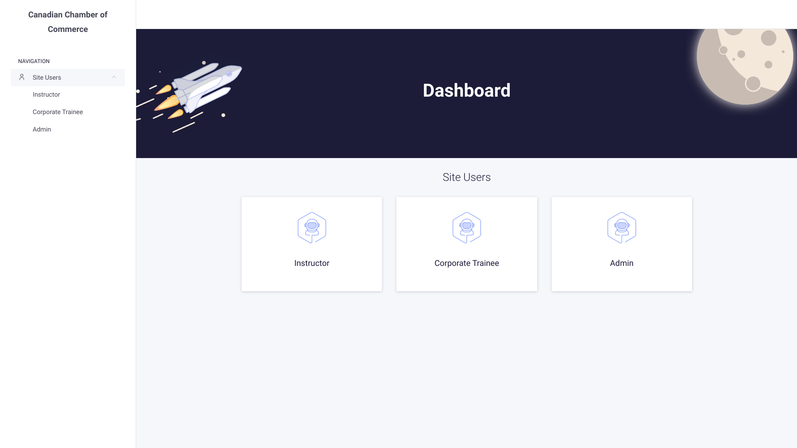

# Linear-Depression

An implementation of full stack web application using the MERN stack. The application is a platform for users to manage an online learning platform. The application is built using the `MERN` stack.

## Badges

[](https://choosealicense.com/licenses/mit/)

## Motivation

This project was created for The GUC `CSEN704 Advanced Computer lab` The lab is a project-based course that aims to teach students

-   Scrum and Agile methodologies
-   Software development best practices
-   Software development tools and techniques
-   Software development process
-   Software Testing
-   latest backend and frontend technologies

## Build Status

-   The project is currently in development.
-   The Unit tests needs modifications.
-   A CI/CD pipeline needs to be migrated to Jenkins.
-   A caching layer needs to be added to the application.
-   A message broker needs to be added to the application to handle asynchronous tasks such as sending emails and notifications.

## Code Style

The code style is enforced using `eslint` and `prettier`. The code style is enforced using `pre-commit` hooks and `pre-commit github action.`

### Pre-commit

The pre-commit hook is managed by pre-commit. It is a versatile way of managing the pre-commit tool but it also permits you to run the script on arbitrary files without committing. The module will take charge of installing your required dependencies (such as code-style tools: prettier, eslint, etc.) and will run them on the files you want to commit.

Install pre-commit package by running

```bash
pip install pre-commit
```

Once installed, run the following for a one-time setup

```bash
pre-commit install
```

Afterwards, the hook should run the next commit you will attempt!

## Screenshots

To be added

## Tech/Framework used

-   [React](https://reactjs.org/)
-   [Redux](https://redux.js.org/)
-   [Node.js](https://nodejs.org/en/)
-   [Express](https://expressjs.com/)
-   [MongoDB](https://www.mongodb.com/)
-   [Mongoose](https://mongoosejs.com/)
-   [Jest](https://jestjs.io/)
-   [Swagger](https://swagger.io/)
-   [Material-UI](https://material-ui.com/)
-   [Stripe](https://stripe.com/)
-   [Typescript](https://www.typescriptlang.org/)
-   [Git](https://git-scm.com/)
-   [Github Actions](github.com/features/actions)
-   [NodeMailer](https://nodemailer.com/about/)
-   [Handlebars](https://handlebarsjs.com/)
-   [MongoDB Atlas](https://www.mongodb.com/cloud/atlas)
-   [Postman](https://www.postman.com/)
-   [VSCode](https://code.visualstudio.com/)
-   [Pre-commit](https://pre-commit.com/)
-   [Mailtrap](https://mailtrap.io/)

## Features

-   User Authentication
-   User Roles
-   User Profile
-   User Courses
-   User Payments
-   User Notifications
-   User Email Notifications
-   User Password Reset
-   REST API
-   REST API Documentation
-   Admin Dashboard
-   Admin Dashboard Authentication
-   Admin Dashboard Users
-   Refund Policy
-   Corporate Policy
-   Terms and Conditions
-   Fuzzy Search
-   Caching
-   Rate Limiting
-   Rating System
-   Reporting System
-

## Code Examples

```typescript
import { sendEmail } from "./sendMailService";

export const sendCertificateEmail = async (email: string, courseName: string, certificatePath: string) => {
    const context = {
        courseName: courseName,
        email: email
    };
    const attachments = [
        {
            filename: "certificate.pdf",
            path: certificatePath,
            contentType: "application/pdf"
        }
    ];
    sendEmail(email, context, "certificateUponCompletion", "Linear Depression | Congrats 🎉", attachments);
};
```

## Running Tests

The testing is done using `jest`. To run the tests, run the following command

```bash
> npm run test
```

## Installation

Install my-project with `npm`

```bash
> npm https://github.com/Advanced-Computer-Lab-2022/Linear-Depression
> cd Linear-Depression/
> cd server && npm i && cd -
> cd client && npm i -f && cd -
```

## Feedback

If you have any feedback, please reach out to us at [ibrahim.abouelenein@student.guc.edu.eg](mailto:ibrahim.abouelenein@student.guc.edu.eg)

## Optimizations

-   Currency rates are cached using an cron job that runs at 12 AM.
-   Aysyncoureous programming was used.
-   Index was used on db to optimize search

## Authors

-   [@aboueleyes](https://www.github.com/aboueleyes)
-   [@AhmedNasserG](https://www.github.com/AhmedNasserG)
-   [@ShimaaBetah](https://www.github.com/ShimaaBetah)
-   [@MohammadOTaha](https://www.github.com/MohammadOTaha)
-   [@Abdulaziz-Hassan](https://www.github.com/Abdulaziz-Hassaan)

## Contributing

Contributions are always welcome!

See `contributing.md` for ways to get started.

Please adhere to this project's `code of conduct`.

## Environment Variables

To run this project, you will need to add the following environment variables to your .env file

`REACT_APP_API_URL`

`REACT_APP_STRIPE_PUBLISHABLE_KEY`

`MONGO_URL`

`MONGO_TEST_URL`

`SERVER_PORT`

`FRONT_END_URL`

`JWT_ACCESS_TOKEN_SECRET`

`JWT_REFRESH_TOKEN_SECRET`

`EMAIL_HOST`

`EMAIL_PORT`

`EMAIL_USER`

`EMAIL_PASSWORD`

`PASSWORD_RESET_EMAIL_FROM`

`PASSWORD_RESET_EMAIL_SUBJECT`

`EMAIL_FROM`

`STRIPE_SECRET_KEY`

`STRIPE_WEBHOOK_SECRET`

## Project Structure

<details>
<summary>Click to expand!</summary>

```bash
## Project Structure

.
├── client
│   ├── craco.config.js
│   ├── package.json
│   ├── package-lock.json
│   ├── public
│   │   ├── favicon.ico
│   │   ├── index.html
│   │   ├── manifest.json
│   │   └── robots.txt
│   ├── README.md
│   ├── src
│   │   ├── api
│   │   │   ├── endpoints.ts
│   │   │   ├── index.ts
│   │   │   └── report
│   │   │   ├── addReport.ts
│   │   │   ├── addThreadReply.ts
│   │   │   ├── getReport.ts
│   │   │   ├── getUserReports.ts
│   │   │   └── index.ts
│   │   ├── App.tsx
│   │   ├── components
│   │   │   ├── AuthHandler.tsx
│   │   │   ├── Avatar.tsx
│   │   │   ├── CircularProgressBar.tsx
│   │   │   ├── Copyright.tsx
│   │   │   ├── course
│   │   │   │   ├── courseContent
│   │   │   │   │   ├── ContentAccordion.css
│   │   │   │   │   ├── ContentAccordion.tsx
│   │   │   │   │   └── ContentItem.tsx
│   │   │   │   ├── CourseContent.tsx
│   │   │   │   ├── courseHeader
│   │   │   │   │   ├── CourseActions.tsx
│   │   │   │   │   ├── courseInfo
│   │   │   │   │   │   └── BadgeRatedEnrolled.tsx
│   │   │   │   │   └── CourseInfo.tsx
│   │   │   │   ├── CourseHeader.tsx
│   │   │   │   └── CourseReviews.tsx
│   │   │   ├── CourseNavbar.tsx
│   │   │   ├── CoursePrice.tsx
│   │   │   ├── coursesListWithFilters
│   │   │   │   ├── BrowseBy.tsx
│   │   │   │   ├── coursesList
│   │   │   │   │   └── CourseCard.tsx
│   │   │   │   ├── CoursesList.tsx
│   │   │   │   ├── filter
│   │   │   │   │   ├── PriceFilter.tsx
│   │   │   │   │   ├── RatingFilter.tsx
│   │   │   │   │   └── SubjectsFilter.tsx
│   │   │   │   └── Filter.tsx
│   │   │   ├── CoursesListWithFilters.tsx
│   │   │   ├── exercise
│   │   │   │   ├── Header.ts
│   │   │   │   ├── QuestionCard.ts
│   │   │   │   ├── QuestionTitle.ts
│   │   │   │   ├── SolvedQuestion.tsx
│   │   │   │   ├── SubmitButton.ts
│   │   │   │   ├── Title.ts
│   │   │   │   └── TotalGrade.tsx
│   │   │   ├── FloatingButton.ts
│   │   │   ├── GroupRadioButton.tsx
│   │   │   ├── index.ts
│   │   │   ├── modals
│   │   │   │   ├── AddCourse.tsx
│   │   │   │   ├── AddExercise.tsx
│   │   │   │   ├── AddLesson.tsx
│   │   │   │   ├── AddPromotion.tsx
│   │   │   │   ├── AddQuestion.tsx
│   │   │   │   ├── AddReview.tsx
│   │   │   │   ├── EditCourse.tsx
│   │   │   │   ├── EditLesson.tsx
│   │   │   │   ├── EditProfile.tsx
│   │   │   │   ├── index.ts
│   │   │   │   ├── ViewAndAcceptContract.tsx
│   │   │   │   └── ViewMySettlements.tsx
│   │   │   ├── navbar
│   │   │   │   ├── CountrySelect.tsx
│   │   │   │   └── Navbar.css
│   │   │   ├── Navbar.tsx
│   │   │   ├── OptionsButton.tsx
│   │   │   ├── report
│   │   │   │   ├── index.ts
│   │   │   │   ├── listing
│   │   │   │   │   ├── table
│   │   │   │   │   │   ├── BodyContainer.tsx
│   │   │   │   │   │   ├── Header.tsx
│   │   │   │   │   │   └── Row.tsx
│   │   │   │   │   └── TableContainer.tsx
│   │   │   │   ├── new
│   │   │   │   │   ├── Form.tsx
│   │   │   │   │   └── HorizontalCourseCard.tsx
│   │   │   │   ├── PageContainter.tsx
│   │   │   │   ├── PageHeader.tsx
│   │   │   │   └── thread
│   │   │   │   ├── Author.tsx
│   │   │   │   ├── CardContainer.tsx
│   │   │   │   ├── Card.tsx
│   │   │   │   ├── Container.tsx
│   │   │   │   ├── ReplyForm.tsx
│   │   │   │   └── SubjectDivider.tsx
│   │   │   ├── ReviewItem.tsx
│   │   │   ├── SimpleAccordion.tsx
│   │   │   └── VideoPlayer.tsx
│   │   ├── config
│   │   │   └── config.ts
│   │   ├── contexts
│   │   │   ├── AuthProvider.tsx
│   │   │   ├── CountryContext.ts
│   │   │   ├── index.ts
│   │   │   └── ToastProvider.tsx
│   │   ├── hooks
│   │   │   ├── course
│   │   │   │   ├── index.ts
│   │   │   │   ├── useFetchAllCourses.ts
│   │   │   │   ├── useFetchCourseById.ts
│   │   │   │   ├── useFetchMyCourses.ts
│   │   │   │   └── useFetchSubjects.ts
│   │   │   ├── enrollment
│   │   │   │   ├── index.ts
│   │   │   │   └── useFetchMyEnrollment.ts
│   │   │   ├── exercise
│   │   │   │   ├── index.ts
│   │   │   │   ├── useFetchEvaluation.ts
│   │   │   │   └── useFetchExerciseById.ts
│   │   │   ├── index.ts
│   │   │   ├── instructor
│   │   │   │   ├── index.ts
│   │   │   │   └── useGetInstructorContractStatus.ts
│   │   │   ├── lesson
│   │   │   │   ├── index.ts
│   │   │   │   └── useFetchLessonById.ts
│   │   │   ├── localization
│   │   │   │   ├── index.ts
│   │   │   │   └── useGetLocalizationData.ts
│   │   │   ├── note
│   │   │   │   ├── index.ts
│   │   │   │   └── useFetchMyNote.ts
│   │   │   ├── profile
│   │   │   │   ├── index.ts
│   │   │   │   └── useFetchProfile.ts
│   │   │   ├── report
│   │   │   │   ├── index.ts
│   │   │   │   ├── useFetchReports.ts
│   │   │   │   └── useFetchThread.ts
│   │   │   ├── request
│   │   │   │   ├── index.ts
│   │   │   │   ├── useFetchMyAccessRequest.ts
│   │   │   │   └── useFetchMyRefundRequest.ts
│   │   │   ├── review
│   │   │   │   ├── index.ts
│   │   │   │   ├── useFetchCourseReviews.ts
│   │   │   │   ├── useFetchMyReviews.ts
│   │   │   │   └── useFetchMyReviewSubmission.ts
│   │   │   ├── settlements
│   │   │   │   ├── index.ts
│   │   │   │   └── useFetchMySettlements.ts
│   │   │   ├── useAuth.ts
│   │   │   └── useToast.ts
│   │   ├── index.css
│   │   ├── index.tsx
│   │   ├── media
│   │   │   └── country-currency.json
│   │   ├── pages
│   │   │   ├── auth
│   │   │   │   ├── ChangePassword.tsx
│   │   │   │   ├── ForgotPassword.tsx
│   │   │   │   ├── Login.tsx
│   │   │   │   ├── PasswordReset.tsx
│   │   │   │   └── Register.tsx
│   │   │   ├── CorporateTraineeProfile.tsx
│   │   │   ├── Course.tsx
│   │   │   ├── CreateExercise.tsx
│   │   │   ├── Exercise.tsx
│   │   │   ├── home
│   │   │   │   └── AllCourses.tsx
│   │   │   ├── Home.tsx
│   │   │   ├── index.ts
│   │   │   ├── IndividualTraineeProfile.tsx
│   │   │   ├── InstructorCourse.tsx
│   │   │   ├── InstructorExercise.tsx
│   │   │   ├── instructorProfile
│   │   │   │   ├── MyReviews.tsx
│   │   │   │   └── ViewProfile.tsx
│   │   │   ├── InstructorProfile.tsx
│   │   │   ├── lesson
│   │   │   │   └── Note.tsx
│   │   │   ├── Lesson.tsx
│   │   │   ├── MyCourses.tsx
│   │   │   ├── payment
│   │   │   │   ├── Cancelled.tsx
│   │   │   │   ├── index.ts
│   │   │   │   └── Success.tsx
│   │   │   ├── PrivacyPolicy.tsx
│   │   │   ├── Profile.tsx
│   │   │   ├── report
│   │   │   │   ├── List.tsx
│   │   │   │   ├── New.tsx
│   │   │   │   └── Thread.tsx
│   │   │   └── TraineeExercise.tsx
│   │   ├── redux
│   │   │   ├── features
│   │   │   │   ├── course
│   │   │   │   │   └── courseSlice.ts
│   │   │   │   ├── courseList
│   │   │   │   │   └── coursesListSlice.ts
│   │   │   │   ├── enrollment
│   │   │   │   │   └── enrollmentSlice.ts
│   │   │   │   ├── profile
│   │   │   │   │   └── profileSlice.ts
│   │   │   │   └── subjects
│   │   │   │   └── subjectSlice.ts
│   │   │   ├── index.ts
│   │   │   └── store.ts
│   │   ├── reportWebVitals.ts
│   │   ├── services
│   │   │   ├── auth
│   │   │   │   ├── changePassword.ts
│   │   │   │   ├── index.ts
│   │   │   │   ├── login.ts
│   │   │   │   ├── logout.ts
│   │   │   │   ├── performPasswordReset.ts
│   │   │   │   ├── refresh.ts
│   │   │   │   ├── register.ts
│   │   │   │   ├── sendForgotPasswordRequest.ts
│   │   │   │   └── validatePasswordResetToken.ts
│   │   │   ├── course
│   │   │   │   ├── addCourse.ts
│   │   │   │   ├── addPromotion.ts
│   │   │   │   ├── editCourse.ts
│   │   │   │   ├── fetchAllCourses.ts
│   │   │   │   ├── fetchCourseById.ts
│   │   │   │   ├── fetchMyCourses.ts
│   │   │   │   ├── fetchSubjects.ts
│   │   │   │   └── index.ts
│   │   │   ├── enrollment
│   │   │   │   ├── downloadCertificate.ts
│   │   │   │   ├── enrollmentServices.ts
│   │   │   │   ├── enrollOnCourse.ts
│   │   │   │   ├── fetchMyEnrollment.ts
│   │   │   │   ├── index.ts
│   │   │   │   └── updateEnrollment.ts
│   │   │   ├── exercise
│   │   │   │   ├── addExercise.ts
│   │   │   │   ├── fetchEvaluation.ts
│   │   │   │   ├── fetchExerciseById.ts
│   │   │   │   ├── index.ts
│   │   │   │   └── submitExercise.ts
│   │   │   ├── index.ts
│   │   │   ├── instructor
│   │   │   │   ├── acceptInstructorContract.ts
│   │   │   │   ├── getInstructorContractStatus.ts
│   │   │   │   └── index.ts
│   │   │   ├── lesson
│   │   │   │   ├── addLesson.ts
│   │   │   │   ├── editLesson.ts
│   │   │   │   ├── fetchLessonById.ts
│   │   │   │   ├── index.ts
│   │   │   │   └── videoServices.ts
│   │   │   ├── localization
│   │   │   │   ├── fetchCountryCode.ts
│   │   │   │   ├── getCurrency.ts
│   │   │   │   └── index.ts
│   │   │   ├── note
│   │   │   │   ├── addNote.ts
│   │   │   │   ├── downloadPDF.ts
│   │   │   │   ├── editNote.ts
│   │   │   │   ├── fetchMyNote.ts
│   │   │   │   ├── index.ts
│   │   │   │   └── saveAsPDF.ts
│   │   │   ├── payment
│   │   │   │   ├── index.ts
│   │   │   │   └── payment.ts
│   │   │   ├── profile
│   │   │   │   ├── editProfile.ts
│   │   │   │   ├── fetchProfile.ts
│   │   │   │   └── index.ts
│   │   │   ├── request
│   │   │   │   ├── cancelRefundRequest.ts
│   │   │   │   ├── fetchMyAccessRequest.ts
│   │   │   │   ├── fetchMyRefundRequest.ts
│   │   │   │   ├── index.ts
│   │   │   │   ├── sendAccessRequest.ts
│   │   │   │   └── sendRefundRequest.ts
│   │   │   ├── review
│   │   │   │   ├── addCourseReview.ts
│   │   │   │   ├── addInstructorReview.ts
│   │   │   │   ├── fetchCourseReviews.ts
│   │   │   │   ├── fetchMyReviewForCourse.ts
│   │   │   │   ├── fetchMyReviewForInstructor.tsx
│   │   │   │   ├── fetchMyReviews.ts
│   │   │   │   ├── index.ts
│   │   │   │   ├── updateCourseReview.ts
│   │   │   │   └── updateInstructorReview.ts
│   │   │   └── settlements
│   │   │   ├── fetchMySettlements.ts
│   │   │   └── index.ts
│   │   ├── types
│   │   │   ├── AccessRequest.ts
│   │   │   ├── auth
│   │   │   │   ├── index.ts
│   │   │   │   ├── login.ts
│   │   │   │   └── register.ts
│   │   │   ├── Country.ts
│   │   │   ├── Course.ts
│   │   │   ├── Enrollment.ts
│   │   │   ├── enums
│   │   │   │   ├── index.ts
│   │   │   │   ├── ReportStatus.ts
│   │   │   │   ├── ReportType.ts
│   │   │   │   └── UserType.ts
│   │   │   ├── Evaluation.ts
│   │   │   ├── Exercise.ts
│   │   │   ├── FormProps.ts
│   │   │   ├── index.ts
│   │   │   ├── Instructor.ts
│   │   │   ├── Lesson.ts
│   │   │   ├── Note.ts
│   │   │   ├── Profile.ts
│   │   │   ├── Promotion.ts
│   │   │   ├── Question.ts
│   │   │   ├── RefundRequest.ts
│   │   │   ├── report
│   │   │   │   ├── index.ts
│   │   │   │   ├── ReportFormProps.ts
│   │   │   │   ├── ReportThread.ts
│   │   │   │   └── Report.ts
│   │   │   ├── ReviewSubmission.ts
│   │   │   ├── Review.ts
│   │   │   └── User.ts
│   │   └── utils
│   │   ├── index.ts
│   │   └── validateFormData.ts
│   ├── tsconfig.json
│   └── tsconfig.paths.json
├── contributing.md
├── docs
│   ├── AdminDashboard.png
│   └── APIDocs.png
├── LICENSE
├── README.md
└── server
├── babel.config.js
├── jest.config.ts
├── package.json
├── package-lock.json
├── public < -- public static files (images, fonts, etc.)
│   ├── admin
│   │   └── css
│   │   └── dashboard.css
│   ├── assets
│   │   ├── qr.png
│   │   └── winners.png
│   ├── certificates
│   │   ├── 63a5dd8a26d81baf0958bb2e.pdf
│   │   ├── 63a6000d6828d41508671a8d.pdf
│   │   ├── 63a6050cd7ed49254b880181.pdf
│   ├── fonts
│   │   ├── NotoSansJP-Bold.otf
│   │   ├── NotoSansJP-Light.otf
│   │   └── NotoSansJP-Regular.otf
│   └── notes
│   ├── 63a225e117897bfd964a8417.pdf
│   └── 63a89405c0fa640e7e80b26f.pdf
├── src
│   ├── admin
│   │   ├── components
│   │   │   ├── AddPromotion.tsx
│   │   │   └── dashboard.tsx
│   │   ├── config.ts
│   │   ├── hooks
│   │   │   └── hashPasswordInPayload.ts
│   │   ├── index.ts
│   │   ├── locale
│   │   │   └── en
│   │   │   ├── index.ts
│   │   │   └── report.json
│   │   └── resources
│   │   ├── AccessRequest.ts
│   │   ├── Admin.ts
│   │   ├── CorporateTrainee.ts
│   │   ├── Course.ts
│   │   ├── IndividualTrainee.ts
│   │   ├── Instructor.ts
│   │   ├── RefundRequest.ts
│   │   ├── Report.ts
│   │   └── User.ts
│   ├── config
│   │   └── config.ts
│   ├── controllers <--- API Controllers
│   │   ├── AccessRequest.ts
│   │   ├── Auth.ts
│   │   ├── CorporateTrainee.ts
│   │   ├── CourseRating.ts
│   │   ├── Course.ts
│   │   ├── Currency.ts
│   │   ├── Enrollment.ts
│   │   ├── Exercise.ts
│   │   ├── IndividualTrainee.ts
│   │   ├── InstructorRating.ts
│   │   ├── Instructor.ts
│   │   ├── Lesson.ts
│   │   ├── Note.ts
│   │   ├── PasswordResetToken.ts
│   │   ├── Payment.ts
│   │   ├── Profile.ts
│   │   ├── Promotion.ts
│   │   ├── RefundRequest.ts
│   │   ├── Report.ts
│   │   ├── Settlement.ts
│   │   └── UserType.ts
│   ├── enums
│   │   └── UserTypes.ts
│   ├── media
│   │   ├── country-currency.json
│   │   └── currency-rates.json
│   ├── middleware <----------------- Middlewares are here
│   │   ├── logger.ts
│   │   ├── permissions <----------------- Middlewares Permissions are here
│   │   │   ├── isAuthenticated.ts
│   │   │   ├── isAuthorized.ts
│   │   │   ├── isCourseOwner.ts
│   │   │   ├── isEnrolled.ts
│   │   │   ├── isOwnerOrEnrolled.ts
│   │   │   └── isRatingOwner.ts
│   │   └── rateLimiter.ts
│   ├── models <----------------- Models are here
│   │   ├── AccessRequest.ts
│   │   ├── Admin.ts
│   │   ├── Answer.ts
│   │   ├── CorporateTrainee.ts
│   │   ├── Course.ts
│   │   ├── Enrollment.ts
│   │   ├── Exercise.ts
│   │   ├── IndividualTrainee.ts
│   │   ├── Instructor.ts
│   │   ├── Lesson.ts
│   │   ├── Note.ts
│   │   ├── PasswordResetToken.ts
│   │   ├── Promotion.ts
│   │   ├── Rating.ts
│   │   ├── RefundRequest.ts
│   │   ├── ReportThread.ts
│   │   ├── Report.ts
│   │   ├── Settlement.ts
│   │   ├── Trainee.ts
│   │   └── User.ts
│   ├── routes <----------------- Routes are here
│   │   ├── Auth.ts
│   │   ├── CorporateTrainee.ts
│   │   ├── Course.ts
│   │   ├── Currency.ts
│   │   ├── Enrollment.ts
│   │   ├── IndividualTrainee.ts
│   │   ├── Instructor.ts
│   │   ├── Me.ts
│   │   ├── Payment.ts
│   │   ├── Promotion.ts
│   │   └── UserType.ts
│   ├── server.ts
│   ├── services
│   │   ├── certificateService.ts
│   │   ├── CourseServices.ts
│   │   ├── emails <----------------- Email services are here
│   │   │   ├── accessRequests
│   │   │   │   ├── sendAccessRequestApprovalEmail.ts
│   │   │   │   ├── sendAccessRequestCreationEmail.ts
│   │   │   │   └── sendAccessRequestRejectionEmail.ts
│   │   │   ├── refundRequests
│   │   │   │   ├── sendRefundRequestApprovalEmail.ts
│   │   │   │   ├── sendRefundRequestCreationEmail.ts
│   │   │   │   └── sendRefundRequestRejectionEmail.ts
│   │   │   ├── sendCertificateEmail.ts
│   │   │   ├── sendEnrollmentEmail.ts
│   │   │   ├── sendMailService.ts
│   │   │   ├── sendPasswordResetEmail.ts
│   │   │   └── templates <----------------- Email templates are here
│   │   │   ├── accessRequestApproval.html
│   │   │   ├── accessRequestCreation.html
│   │   │   ├── accessRequestRejection.html
│   │   │   ├── certificateUponCompletion.html
│   │   │   ├── instructorCredit.html
│   │   │   ├── partials
│   │   │   │   ├── footer.html
│   │   │   │   └── header.html
│   │   │   ├── passwordResetEmail.html
│   │   │   ├── refundRequestApproval.html
│   │   │   ├── refundRequestCreation.html
│   │   │   └── refundRequestRejection.html
│   │   ├── EnrollmentCreateServices.ts
│   │   ├── PasswordResetTokenServices.ts
│   │   ├── SettlementService.ts
│   │   ├── UserServices.ts
│   │   └── videoServices.ts
│   ├── start.ts
│   ├── swagger.json
│   ├── swagger.ts <------------------ Swagger Generation ------------------
│   ├── tasks
│   │   └── cacheCurrencyRates.ts
│   ├── tests <------------------ Tests ------------------
│   │   ├── test_apis <------------------ API Tests ------------------
│   │   │   ├── course
│   │   │   │   └── course.test.ts
│   │   │   ├── course_ratings
│   │   │   │   └── rating.test.ts
│   │   │   ├── example.test.ts
│   │   │   ├── instructor
│   │   │   │   └── instructor.test.ts
│   │   │   ├── instructor_ratings
│   │   │   │   └── instructor_ratings.test.ts
│   │   │   └── trainee
│   │   │   ├── corporateTrainee.test.ts
│   │   │   └── individualTrainee.test.ts
│   │   ├── test_models <------------------ Model Tests ------------------
│   │   │   ├── answer
│   │   │   │   ├── answer.test.ts
│   │   │   │   └── factory.ts <------------------ Factory ------------------
│   │   │   ├── course
│   │   │   │   ├── course.test.ts
│   │   │   │   └── factory.ts
│   │   │   ├── enrollment
│   │   │   │   └── factory.ts
│   │   │   ├── exercise
│   │   │   │   ├── exercise.test.ts
│   │   │   │   └── factory.ts
│   │   │   ├── instructor
│   │   │   │   ├── factory.ts
│   │   │   │   └── instructor.test.ts
│   │   │   ├── lesson
│   │   │   │   ├── factory.ts
│   │   │   │   └── lesson.test.ts
│   │   │   ├── rating
│   │   │   │   ├── factory.ts
│   │   │   │   └── rating.test.ts
│   │   │   ├── trainee
│   │   │   │   ├── factory.ts
│   │   │   │   └── trainee.test.ts
│   │   │   └── userFactory.ts
│   │   ├── test_services <------------------ Service Tests ------------------
│   │   │   └── CourseService.test.ts
│   │   └── test_utils
│   │   └── modelUtilities.test.ts
│   └── utils
│   ├── auth
│   │   └── token.ts
│   ├── loadModelsUtil.ts
│   ├── parseQueryParams.ts
│   ├── populateTestDb.ts
│   └── testUtilities.ts
└── tsconfig.json
```

</details>

## License

The software is open source under the GPL.3 License.

[GPT3](https://choosealicense.com/licenses/gpl-3.0/)

## Stripe in development mode

how to run stripe in development mode

1. update your .env file in both the client and server bu following the .env.example files
2. install the stripe cli

```bash
sudo apt install stripe # for linux
brew install stripe/stripe-cli/stripe # for mac
```

you can refer to this [documentation](https://stripe.com/docs/stripe-cli) for more information

3. login to to stripe cli using stripe api key

```bash
stripe login --api-key sk_test_example
# contact the team for the api key or use your own
```

4. run the stripe cli

```bash
stripe listen --forward-to localhost:PORT/payment/stripe-webhook
# PORT is the port you are running the server on
```

## Testing

The testing is done using jest. To run the tests, run the following command

```bash
npm run test
```

You can use vscode to run the tests as well.

---

## Admin Dashboard

Access the admin dashboard by going to the following URL

```
http://localhost:PORT/admin
```



## API Documentation

The API documentation is done using swagger. To access the documentation, go to the following URL

```
http://localhost:PORT/api-docs
```


### Courses Resource

#### Get all Courses

```http
  GET /courses
```

<details>
<summary>
Response
</summary>

```json
[
    {
        "enrollmentsCount": 0,
        "activePromotion": null,
        "_id": "636026eb1828121ec06086ee",
        "title": "Intro to backend",
        "description": "javascript is baaaad",
        "instructor": {
            "_id": "636020ca8701caab59e5dc30",
            "firstName": "Elshimaa",
            "lastName": "Ahmed",
            "__t": "Instructor",
            "id": "636020ca8701caab59e5dc30"
        },
        "subject": "backend",
        "price": 13.31,
        "averageRating": 5,
        "ratings": [
            {
                "_id": "63ac8bc07d024a636f415c5d",
                "comment": "new review",
                "rating": 5,
                "traineeId": "63a4ce661751cf3eff56d6f7",
                "createdAt": "2022-12-28T18:32:32.458Z",
                "updatedAt": "2022-12-28T18:38:17.211Z",
                "__v": 0,
                "id": "63ac8bc07d024a636f415c5d"
            }
        ],
        "totalHours": 0,
        "discount": 0,
        "lessons": [],
        "isFree": false,
        "__v": 0,
        "thumbnail": "https://vishwaentertainers.com/wp-content/uploads/2020/04/No-Preview-Available.jpg",
        "id": "636026eb1828121ec06086ee",
        "currency": "USD"
    },
    {
        "enrollmentsCount": 0,
        "_id": "63602a05823c823dda88323b",
        "title": "python in 4 days",
        "description": "python in 3 days",
        "instructor": {
            "_id": "6362ed27802b350e006822cd",
            "firstName": "Ibrahim",
            "lastName": "Abouelenien",
            "__t": "Instructor",
            "id": "6362ed27802b350e006822cd"
        },
        "subject": "backend",
        "price": 53.24,
        "averageRating": 4,
        "ratings": [],
        "totalHours": 0,
        "discount": 0,
        "lessons": [],
        "isFree": false,
        "__v": 1,
        "activePromotion": null,
        "preview": "https://youtu.be/93KmHm4ggPo",
        "thumbnail": "https://img.youtube.com/vi/93KmHm4ggPo/0.jpg",
        "id": "63602a05823c823dda88323b",
        "currency": "USD"
    },
    {
        "enrollmentsCount": 0,
        "_id": "63602a25823c823dda883245",
        "title": "java in 3 days",
        "description": "java in 3 days",
        "instructor": {
            "_id": "636020ca8701caab59e5dc30",
            "firstName": "Elshimaa",
            "lastName": "Ahmed",
            "__t": "Instructor",
            "id": "636020ca8701caab59e5dc30"
        },
        "subject": "backend",
        "price": 266.17,
        "averageRating": 0,
        "ratings": [],
        "totalHours": 0,
        "discount": 0,
        "lessons": [],
        "isFree": false,
        "__v": 0,
        "activePromotion": null,
        "thumbnail": "https://vishwaentertainers.com/wp-content/uploads/2020/04/No-Preview-Available.jpg",
        "id": "63602a25823c823dda883245",
        "currency": "USD"
    }
]
```

</details>

#### Create Course

```http
  POST /courses
```

| Parameter       | Type     | Description                                   |
| :-------------- | :------- | :-------------------------------------------- |
| `Authorization` | `string` | **Required**. Bearer token of the instructor. |
| `title`         | `string` | **Required**. Title of the course             |
| `subject`       | `string` | **Required**. Subject of the course           |
| `description`   | `string` | **Required**. Description of the course       |
| `price`         | `number` | **Required**. Price of the course             |

<details>
<summary>
Request
</summary>

```json
{
    "course": {
        "title": "How to use curl",
        "description": "Learn how to use curl to make HTTP requests from the command line or scripts",
        "instructor": "6384904acf1b15bc21323b81",
        "subject": "Programming",
        "price": 10,
        "averageRating": 0,
        "ratings": [],
        "totalHours": 0,
        "enrollmentsCount": 0,
        "discount": 0,
        "activePromotion": null,
        "lessons": [],
        "_id": "63ade6b9840f840cca37802f",
        "createdAt": "2022-12-29T19:12:57.494Z",
        "updatedAt": "2022-12-29T19:12:57.494Z",
        "__v": 0
    }
}
```

### Generate API Documentation

```bash
> npm run generate-docs
```
